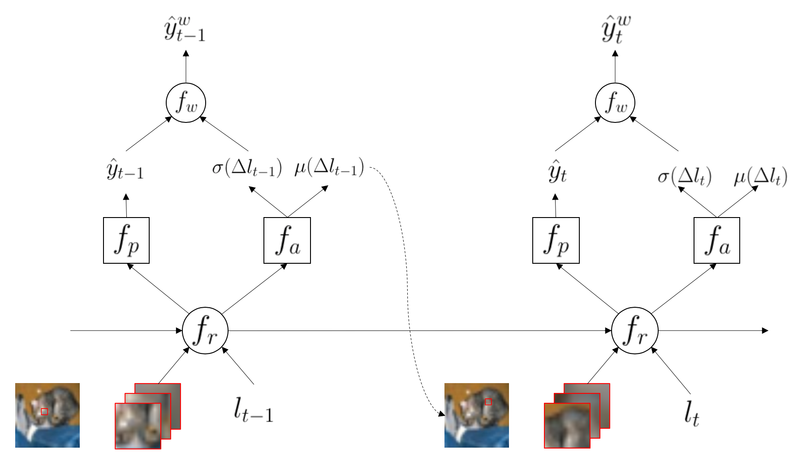

## Submission to IEEE ICCAS 2020
## Gaussian RAM: Lightweight Image Classification via Stochastic Retina Inspired Glimpse and Reinforcement Learning

Official PyTorch implementation of Gaussian-RAM

### Requirements
- Python3
- PyTorch (> 1.0)
- torchvision (> 0.2)
- NumPy
